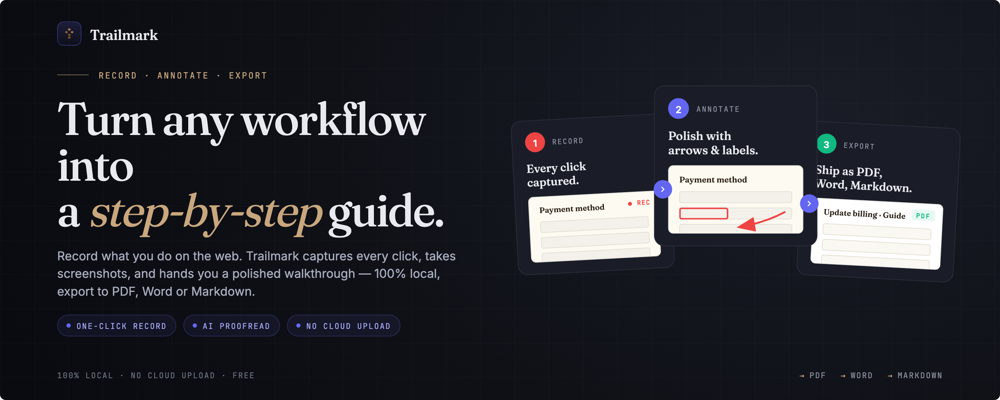

<p align="center">
  
</p>

<h1 align="center">Trailmark</h1>

<p align="center">
  Record any web workflow and export it as a step-by-step PDF, Markdown, or Word guide.
</p>

<p align="center">
  
  
  
</p>

---

## What it does

Trailmark is a Chrome extension that records how you navigate a website and turns it into a polished step-by-step walkthrough. Each time you click during a recording session it captures a screenshot, reads the element you clicked, and writes a short instruction sentence — either from a template or, if you've configured Claude / OpenAI / Gemini with your own API key, from an AI-generated description. You can then annotate the screenshots in a built-in editor and export the result as a PDF, Markdown bundle, or Word document.

## Screenshots



## Install

### From the Chrome Web Store

> ⏳ **Pending review** — Trailmark is awaiting Chrome Web Store approval. Until the listing goes live, you can install it yourself in under a minute using either option below.

<!-- Flip this in once the Store listing is approved. -->
<!-- [Install Trailmark on the Chrome Web Store](https://chrome.google.com/webstore/detail/YOUR_ID) -->

### From the latest release (easiest)

1. Go to the [Releases page](https://github.com/Jordhwm/trailmark-extension/releases) and download the `trailmark-vX.Y.Z.zip` from the latest release's **Assets**.
2. Unzip it somewhere you won't delete (e.g. `~/Applications/trailmark` on macOS, `C:\Tools\trailmark` on Windows).
3. Open `chrome://extensions`.
4. Toggle **Developer mode** on (top right).
5. Click **Load unpacked** and select the unzipped folder.
6. Pin the Trailmark icon to your toolbar.

### From source (for development)

```bash
git clone https://github.com/Jordhwm/trailmark-extension.git
cd trailmark-extension
```

Then `chrome://extensions` → **Developer mode** → **Load unpacked** → select the `trailmark-extension` folder.

---

Trailmark works fully offline — no sign-up, no cloud upload. If you want AI-generated step descriptions, add your own Claude, OpenAI, or Gemini API key under **Settings** inside the extension.

## Usage

- **Record** — click the Trailmark icon on any website and press **Start Recording**. Each click captures a new step with a screenshot and an auto-generated description.
- **Annotate** — click **Edit & Export** to open the editor. Draw rectangles, arrows, highlights, text labels, or blur sensitive regions directly on each screenshot.
- **Proofread descriptions** — if you've added an AI provider in Settings, click **AI Proofread** on any step to get a clarity/grammar check with a one-click rewrite.
- **Export** — save the walkthrough as a PDF, a Markdown bundle (with PNGs), or a Microsoft Word document.

## Development

### Project structure

```
trailmark-extension/
├── manifest.json                  Manifest V3 config
├── background.js                  Service worker: LLM adapters, screenshot + step pipeline
├── content.js                     Content script: click tracking + on-page recording indicator
├── popup/                         Toolbar popup UI
├── options/                       Settings page (provider, model, API key)
├── editor/                        Full-tab annotation editor + export
├── icons/                         Extension icons (16/48/128 PNG + source SVG)
└── lib/
    └── jspdf.umd.min.js           Bundled PDF export library (third-party, MIT)
```

### Making changes

There's no build step — Trailmark is plain HTML, CSS, and JavaScript loaded directly by Chrome. After editing any file:

1. Open `chrome://extensions`.
2. Click the reload icon on the Trailmark card.
3. Reopen the popup / editor / options page to see your changes.

Service worker and content-script changes take effect immediately after reload. Page changes from an already-open tab require you to refresh that tab so the new content script injects.

### Testing locally

- Load the unpacked extension (see **Install → From source**).
- Record a short flow on any site to exercise the capture pipeline.
- Open the editor to exercise annotations and exports (PDF / MD / Word).
- In Settings, add an API key from any supported provider and click **Refresh models** / **Test Connection** to exercise the LLM path.

## Tech stack

- **Manifest V3** — Chrome extension platform
- **Vanilla JavaScript** — no framework, no build step
- **HTML + CSS** — all UI surfaces (popup, options, editor)
- **[jsPDF](https://github.com/parallax/jsPDF)** — PDF export (bundled, MIT licensed)
- **LLM providers (optional)** — Anthropic Claude, OpenAI, Google Gemini, or any OpenAI-compatible endpoint

## Contributing

Issues and PRs welcome. See [`.github/ISSUE_TEMPLATE/`](.github/ISSUE_TEMPLATE) for bug and feature templates, and [`.github/PULL_REQUEST_TEMPLATE.md`](.github/PULL_REQUEST_TEMPLATE.md) for the PR template.

Before opening a PR, please:

- Test your change unpacked in Chrome and confirm no regressions on a recorded walkthrough.
- Keep commits focused and the diff small where possible.
- Avoid adding dependencies unless there's a strong reason — the extension is intentionally build-free.

## License

MIT — see [LICENSE](LICENSE).

## Acknowledgements

- [jsPDF](https://github.com/parallax/jsPDF) for PDF generation.
<!-- Add more acknowledgements here as the project grows. -->
